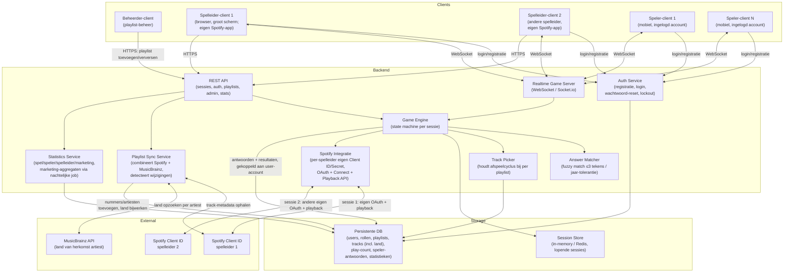
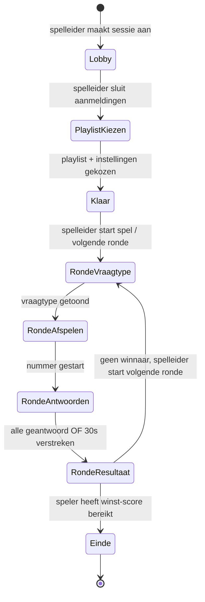
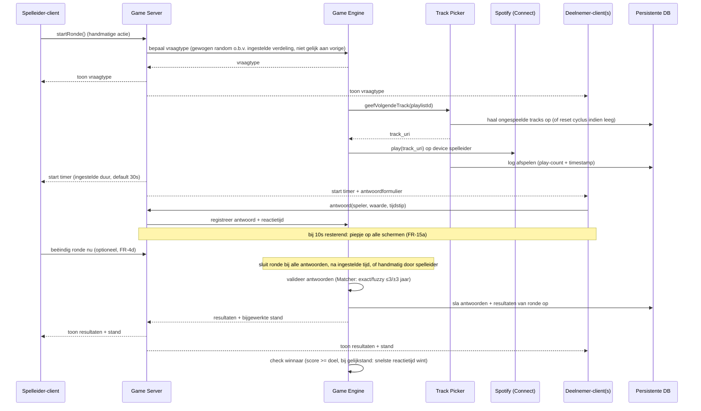
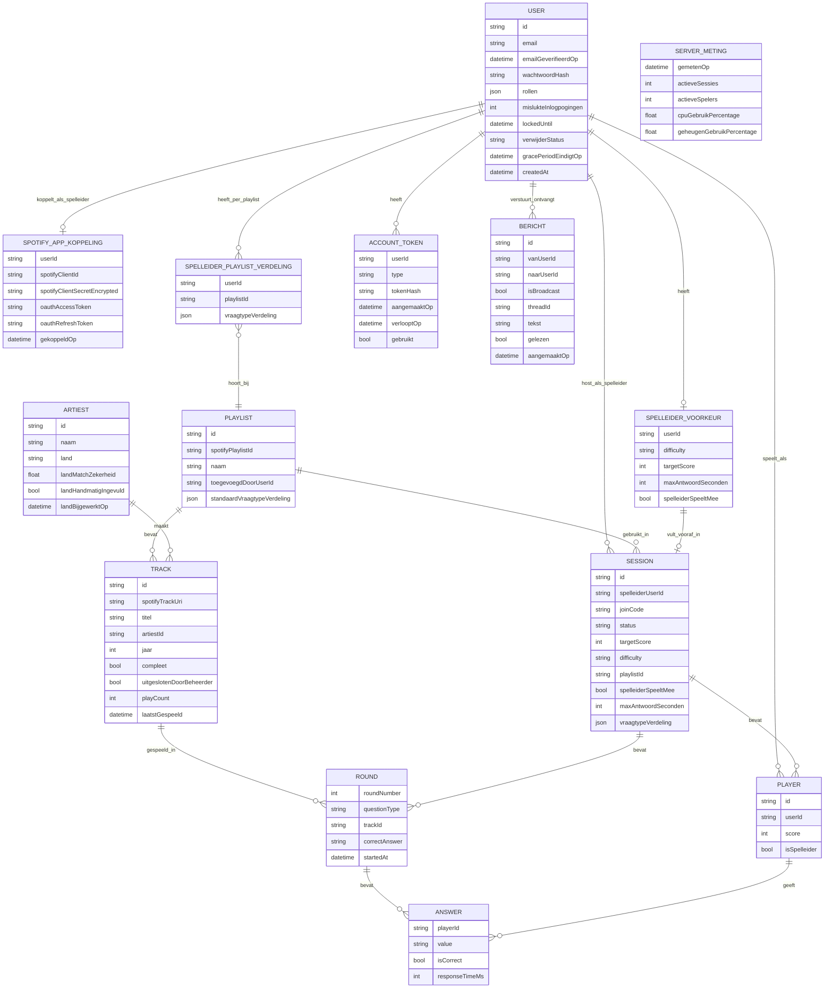

# Architectuur – DJMusica

## 1. High-level componenten

**Toelichting:**
- Nieuwe **Auth Service**: regelt registratie mét e-mailverificatie (FR-55), login (e-mail + wachtwoord, met wachtwoordeisen FR-56), wachtwoord-resetlinks (FR-34) en de oplopende wachttijd na 5 mislukte pogingen per account+IP-combinatie (FR-35). Meldingen rond registratie/reset zijn altijd neutraal, zodat niet te achterhalen is welke e-mailadressen bestaan. De Auth Service beheert ook de sessieduur (FR-57): buiten een actief spel verloopt een login na 2 uur, met een 60-seconden-aftelwaarschuwing en een verleng-knop; tijdens een actief spel nooit. Elk account kan meerdere rollen hebben (FR-36), maar de beheerder-rol is uitsluitend buiten de app om toekenbaar (FR-58) — er bestaat geen endpoint voor.
- **Let op, naamsverwarring vermijden**: de "login-sessie" hierboven (hoe lang iemand ingelogd blijft, FR-57) is een ander begrip dan de `SESSION`-entiteit in het datamodel (sectie 4), die een **spelsessie** is (één spelletje met een spelleider en spelers). Beide heten toevallig "sessie" in de omgangstaal, maar zijn technisch losstaand: een login-sessie kan blijven bestaan over meerdere spelsessies heen, en hoeft niet in dezelfde tabel/opslag te zitten.
- Nieuwe rol **Beheerder** voegt publieke Spotify-afspeellijsten toe via een eigen (simpel) beheerscherm; deze worden in de **Persistente DB** opgeslagen, inclusief de nummers die erin zitten.
- **Elke spelleider koppelt een eigen Spotify-app** (eigen Client ID/Secret, FR-37) via een geleide wizard. Hierdoor draaien meerdere spelleiders (GM1, GM2, ...) volledig onafhankelijk naast elkaar, elk tegen hun eigen Spotify Client ID — de 5-accounts-limiet van Spotify's Development Mode (NFR-10) geldt zo per spelleider, niet gedeeld over de hele applicatie (FR-38).
- De **Track Picker** houdt per afspeellijst bij welke nummers al zijn afgespeeld (en hoe vaak); kiest random uit de "nog niet gespeelde" set, en reset de cyclus zodra alle nummers een keer geweest zijn (FR-25/26).
- De **Playlist Sync Service** combineert meerdere bronnen tot één trackrecord in de DB (FR-30/31): titel/artiest/jaar/URI via Spotify. Land van herkomst wordt nu op **artiest-niveau** bepaald en gecachet (FR-28): bij een nieuw nummer van een al bekende artiest wordt het land direct hergebruikt, zonder nieuwe MusicBrainz-aanroep.
- Nieuwe **Statistics Service**: berekent spel-, speler- en spelleiderstatistieken grotendeels realtime uit `ANSWER`/`ROUND`/`SESSION` (FR-39 t/m FR-41), en marketingstatistieken (FR-42) via een nachtelijke aggregatiejob (te zwaar om steeds live te berekenen over de hele DB). Vergelijkende cijfers (FR-43) vergelijken een speler tegen het gemiddelde van alle spelers. Daarnaast bewaakt de Statistics Service de serverbelasting (FR-42a t/m 42c): elke paar minuten wordt een `SERVER_METING`-rij toegevoegd, en wordt gecheckt of de door de beheerder ingestelde drempel is overschreden — zo ja, dan verstuurt de service (via dezelfde e-mailservice als FR-34/55) een waarschuwingsmail, met een hersteld-mail zodra het weer normaal is.
- **Persistente DB** bevat nu ook de `USER`-tabel (accounts, rollen, wachtwoord-hash) naast playlists, afspeelhistorie en statistieken — dit maakt het mogelijk dat een speler zijn statistieken behoudt, ongeacht bij welke spelleider hij/zij meespeelt (FR-27, FR-36).
- **Session Store** blijft apart voor de *lopende* sessie-state — dit hoeft niet persistent te zijn.
- **Answer Matcher** blijft losgekoppeld zodat fuzzy-matchlogica (Levenshtein ≤ 3) apart getest kan worden.
- **Spelleider als deelnemer** (FR-4a t/m 4c): de Game Engine behandelt de spelleider, indien hij/zij meespeelt, als een normaal `PLAYER`-record gekoppeld aan hetzelfde `USER`-account als de besturingsrechten.
- **Responsive spelleider-scherm** (herzien NFR-2): de spelleider-UI wordt met dezelfde componenten opgebouwd voor groot scherm én telefoonformaat (bv. via CSS-breakpoints/responsive grid), zodat een spelleider zowel op iPad als iPhone het spel goed kan bedienen.
- **Stabiele layout, geen verspringing** (herzien NFR-2): correcte `viewport`-meta-tag en CSS `env(safe-area-inset-*)` voor notch/dynamic island; elementen die asynchroon vullen (avatars, live-antwoordenlijst, laadindicatoren) krijgen vooraf gereserveerde ruimte (vaste hoogtes/skeleton-states) zodat de rest van de pagina niet verspringt zodra data binnenkomt.
- **Canonieke landenlijst** (FR-28c/28d): een statische referentiedataset (bv. ISO 3166-1 landnamen) wordt gebruikt op twee plekken: (1) het land-kiesscherm van de beheerder (alfabetisch bladerbaar of live doorzoekbaar op substring), en (2) het genereren van multiple-choice-opties bij het vraagtype "land van herkomst artiest". Zo blijven opgeslagen en getoonde landnamen altijd consistent, en is er geen los invoerveld met risico op tikfouten.
- **Eindscherm-pariteit** (herzien FR-23): de Game Engine broadcast de "Einde"-state met winnaar en eindstand naar alle verbonden clients tegelijk (spelers én spelleider) via dezelfde WebSocket-boodschap, zodat iedereen exact hetzelfde eindscherm ziet, niet alleen het grote scherm van de spelleider.
- **Server-side spelvalidatie** (FR-60, anti-valsspelen): de Game Engine is de enige bron van waarheid voor tijd en uitslag. Rondestart- en sluitmomenten leven op de server; antwoorden die na sluiting binnenkomen worden geweigerd; de reactietijd = servermoment van ontvangst minus servermoment van rondestart. Alles wat de client zelf over tijd of correctheid beweert, wordt genegeerd.
- **WebSocket-autorisatie** (FR-61): de Realtime Game Server koppelt elke verbinding bij het opzetten aan het ingelogde account, en valideert bij élk bericht: (1) hoort dit account bij deze sessie, (2) staat de rol deze actie toe (alleen de spelleider van de sessie mag ronde-besturing sturen). Geweigerde pogingen worden gelogd (NFR-14).
- **Join-codes** (FR-59): gegenereerd met ≥6 tekens uit een tekenset zonder verwarrende tekens, gekoppeld aan een vervaltijd (bij sessiestart of na 4 uur), met rate-limiting op het join-endpoint tegen geautomatiseerd raden.

## 2. Sessie state machine

## 3. Sequence diagram – één ronde

## 4. Datamodel (kern-entiteiten)

**Toelichting datamodel:**
- `USER` is nieuw en centraal (FR-33/FR-36): één account per persoon, met een e-mailadres, gehasht wachtwoord, en een lijst van rollen (`speler`, `spelleider`, `beheerder` — kunnen samen voorkomen). `mislukteInlogpogingen` en `lockedUntil` ondersteunen de oplopende wachttijd na 5 mislukte pogingen (FR-35, NFR-11).
- `USER.verwijderStatus` en `gracePeriodEindigtOp` ondersteunen het verwijderproces (FR-44 t/m 49): waarden zijn bv. `actief`, `wachtOpMailbevestiging`, `inGracePeriod`, `permanentVerwijderd`. `ACCOUNT_TOKEN` bewaart alle beveiligde eenmalige e-maillinks op één plek, met een `type`-veld: `verwijderen` (24u geldig, FR-49), `emailVerificatie` (24u, FR-55) en `wachtwoordReset` (1u, FR-34). Altijd gehasht opgeslagen (nooit het token zelf), eenmalig bruikbaar, met vervaltijd — zo gelden dezelfde strenge regels automatisch voor alle drie de linksoorten.
- Bij permanente verwijdering (na de grace period) wordt de `USER`-rij **niet** hard verwijderd, maar worden `email`, `wachtwoordHash` en overige persoonsgegevens overschreven/gewist, met de rij zelf (en het `id`) behouden als anonieme placeholder ("Verwijderde speler"). Zo blijven foreign keys vanuit `PLAYER`/`ANSWER` naar deze rij geldig, en blijven scoreborden/statistieken van andere, nog actieve spelers intact (FR-48).
- `SPOTIFY_APP_KOPPELING` bewaart, per `USER` die de spelleider-rol activeert, diens eigen Spotify Client ID/Secret en OAuth-tokens (FR-37) — dit vervangt één centrale Spotify-app-registratie voor de hele applicatie.
- `PLAYER.userId` en `SESSION.spelleiderUserId` koppelen sessie-deelname terug aan een vast `USER`-account, in plaats van alleen een los ingevulde naam. Zo blijven statistieken (`ANSWER`, FR-27) van een speler intact, ongeacht bij welke spelleider hij/zij meespeelt (FR-36).
- **Eén actieve sessie per account** (FR-3a): bij het joinen of starten van een sessie controleert de Game Engine of dit account al een `PLAYER`-record heeft in een sessie met status ≠ afgerond, of zelf `spelleiderUserId` is van zo'n lopende sessie. Zo niet, dan wordt de nieuwe deelname geweigerd. Dit is een check per account, niet een limiet op het totaal aantal gelijktijdige sessies in de applicatie (FR-38 blijft onbeperkt aantal spelleiders/sessies toestaan).
- `BERICHT` ondersteunt de communicatie tussen spelleider en beheerder (FR-50 t/m 53): `vanUserId`/`naarUserId` bepalen afzender/ontvanger; `isBroadcast = true` betekent dat `naarUserId` leeg blijft en het bericht voor alle spelleiders zichtbaar is; `threadId` verwijst naar het oorspronkelijke bericht bij een reactie (leeg als het zelf het eerste bericht in een thread is).
- `SERVER_METING` (FR-42a t/m 42c) is een losse, periodiek gevulde tabel (geen koppeling aan een specifiek account nodig) die elke meetronde (bv. elke 5 minuten) een rij toevoegt met het aantal actieve sessies/spelers en het CPU-/geheugengebruik op dat moment. Dit voedt zowel het live overzicht (laatste rij) als de historische grafiek (alle rijen over tijd) voor de beheerder. Een aparte, lichte achtergrondtaak vergelijkt bij elke meting de laatste CPU-/geheugenwaarde met de door de beheerder ingestelde drempel, en triggert de e-mailwaarschuwing (met de "hooguit 1x per uur"-regel) via de Statistics Service.
- `ARTIEST` is nieuw (FR-28): land van herkomst wordt hier één keer per artiest vastgelegd, niet per nummer. `landHandmatigIngevuld = true` betekent 100% zekerheid en blokkeert overschrijven bij een volgende sync (FR-28b) — alleen het verwijderen van `land` (en resetten van deze vlag) maakt een nieuwe MusicBrainz-opzoeking mogelijk.
- `TRACK.artiestId` verwijst naar `ARTIEST`; alle nummers van dezelfde artiest delen zo automatisch hetzelfde land, ook nummers die later worden toegevoegd (FR-31).
- `TRACK.compleet` is een afgeleid veld: titel, jaar én het land van de gekoppelde `ARTIEST` zijn allemaal ingevuld; de Track Picker selecteert alleen tracks met `compleet = true` en `uitgeslotenDoorBeheerder = false` (FR-12a/12b).
- `TRACK.playCount` en `laatstGespeeld` zijn de basis voor de afspeelcyclus (FR-25/26): Track Picker kiest random uit tracks met de laagste `playCount` binnen de playlist, en verhoogt deze na afspelen.
- `ANSWER` en `ROUND` blijven persistent (niet alleen in Session Store) zodat statistieken (FR-27, FR-39 t/m 43) over sessies heen opgevraagd kunnen worden, ook nadat een sessie is afgelopen.
- `SPELLEIDER_VOORKEUR` bewaart per `USER` (spelleider-rol) de laatst gebruikte algemene instellingen (moeilijkheidsgraad, punten, tijd, meespelen — FR-32); bij het aanmaken van een nieuwe sessie wordt `SESSION` hiermee vooraf ingevuld, ongeacht welke afspeellijst gekozen wordt, maar blijft aanpasbaar.
- `PLAYLIST.standaardVraagtypeVerdeling` is de door de beheerder ingestelde standaard per afspeellijst (FR-5b), met de fabrieksstandaard (10/20/20/20/20/10%) als terugvaloptie zolang de beheerder niets heeft ingesteld.
- `SPELLEIDER_PLAYLIST_VERDELING` bewaart, per combinatie van spelleider (`userId`) én afspeellijst, de laatst door die spelleider aangepaste verdeling voor die specifieke afspeellijst (FR-10e). Bij het kiezen van een afspeellijst geldt de volgorde: (1) eigen laatst gebruikte verdeling voor déze afspeellijst indien aanwezig, anders (2) `PLAYLIST.standaardVraagtypeVerdeling`. Kiest de spelleider een andere afspeellijst, dan telt de verdeling van die andere afspeellijst — niet de eerder gebruikte verdeling van de vorige afspeellijst.

## 5. Technologiekeuze (voorstel)

| Laag | Voorstel | Reden |
|---|---|---|
| Frontend | React + WebSocket client | Real-time updates, herbruikbare componenten voor GM/speler-view |
| Realtime | Socket.io of native WebSocket | Lage latency sync (NFR-1) |
| Backend | Node.js | Zelfde taal als frontend, goede Spotify SDK-ondersteuning |
| Session store | Redis (in Docker, zelf gehost — zie NFR-12) | Voorbereid op meerdere gelijktijdige sessies (NFR-3), geen betaald abonnement nodig |
| Auth | Eigen Auth Service: **scrypt** voor wachtwoord-hashing (gelijkwaardig aan bcrypt/argon2, maar standaard in Node.js beschikbaar — geen extra library), JWT of sessie-cookies voor ingelogde status, e-mailservice voor resetlinks. Opslag (accounts, tokens, login-sessies) zit achter een repository-interface: eerst in-memory voor snelle/geïsoleerde tests, later PostgreSQL/Redis zonder de Auth Service-logica zelf te hoeven aanpassen | Accounts met e-mail/wachtwoord, oplopende wachttijd na 5 mislukte pogingen (FR-33 t/m FR-35, NFR-11) |
| Persistente DB | PostgreSQL (in Docker, zelf gehost — zie NFR-12) | Users, playlists, tracks, play-count en statistieken moeten vanaf MVP bewaard blijven (NFR-7), zonder terugkerende hostingkosten |
| Spotify | Web API (playlist- en trackmetadata) + Connect API (afspeelbediening op device spelleider), **per spelleider een eigen Client ID/Secret** | Nodig voor FR-5, FR-5a, FR-14, FR-37/38 — volledig gratis |
| Verrijkingsproces (land) | Playlist Sync Service: Spotify Web API (metadata) + MusicBrainz API (land per artiest, gecachet in `ARTIEST`), resultaat opgeslagen in DB | Combineert meerdere bronnen tot één record per artiest, geen live calls tijdens het spelen, geen herhaalde MusicBrainz-calls voor bekende artiesten (FR-28/30/31) — beide API's gratis |
| Statistieken | Statistics Service: directe queries op `ANSWER`/`ROUND`/`SESSION` voor spel/speler/spelleider-stats; nachtelijke aggregatiejob (bv. cron) voor marketingstats | Live stats zijn licht genoeg voor on-demand queries; marketingstats over de hele DB zijn te zwaar voor elke pageview (FR-39 t/m FR-43) |
| E-mail (wachtwoord-reset) | Brevo of Resend, gratis laag (honderden mails/dag/maand) | Ruim voldoende voor een vrienden/familie-schaal app, permanent gratis binnen dat volume (NFR-12) |
| Hosting | Eén gratis "Always Free"-VM (bv. Oracle Cloud Free Tier) met Docker Compose: backend + Postgres + Redis samen op één machine | Écht permanent gratis (geen tijdslimiet/creditcard-verrassing zoals bij "free trial"-aanbieders), voldoende voor dit schaalniveau (NFR-12) |
| Frontend-hosting | GitHub Pages, Cloudflare Pages of Netlify (gratis laag) | Statische React-build, permanent gratis voor een project van deze omvang |
| CI/CD | GitHub Actions | Gratis minuten ruim voldoende voor een project van deze omvang (NFR-12) |
| PWA | `manifest.json` (app-naam, iconen in meerdere formaten, themakleur) + minimale service worker voor installeerbaarheid; `apple-touch-icon`-meta-tags voor iOS | Zorgt dat "Voeg toe aan beginscherm" het DJMusica-logo als app-icoon toont, op zowel Android als iOS (FR-54) |

## 6. Beveiliging (verdediging in lagen, NFR-13)

| Laag | Maatregel |
|---|---|
| Onderweg | HTTPS/TLS verplicht overal, gratis certificaat via Let's Encrypt |
| Opgeslagen data | Wachtwoorden alleen gehasht (scrypt); Spotify Client Secret + OAuth-tokens versleuteld, encryptiesleutel gescheiden van de database bewaard; schijfversleuteling op de VM |
| Infrastructuur | Firewall: alleen poort 443 open naar buiten; SSH uitsluitend met sleutel; Postgres/Redis alleen bereikbaar binnen het interne Docker-netwerk, nooit direct vanaf internet; database-gebruiker van de app heeft minimale rechten (least privilege) |
| Applicatie | ORM/prepared statements tegen SQL-injectie; output-escaping tegen XSS; CSRF-bescherming op formulieren; rate-limiting op login (FR-35) én algemeen op de API |
| Dependencies | Automatische kwetsbaarheden-scan in CI (bv. Dependabot) bij elke build |
| Dataminimalisatie | Alleen e-mailadres en weergavenaam opgeslagen als persoonsgegeven — niets extra's dat niet nodig is voor het spel |
| Back-ups | Automatisch, versleuteld, fysiek/logisch gescheiden van de live-server |
| Account verwijderen | Zie FR-44 t/m FR-49: beveiligde eenmalige e-maillink (min. 128 bits, 24u geldig), verwijderverzoek vereist actieve sessie, rate-limited endpoint, 30 dagen grace period, daarna permanente verwijdering met anonimisering van gedeelde speldata |
| AVG | Recht op inzage/verwijdering (FR-44 t/m 49), privacyverklaring, meldproces richting Autoriteit Persoonsgegevens binnen 72 uur bij een datalek met risico voor gebruikers |
| Accounts | E-mailverificatie bij registratie (FR-55); wachtwoordeisen incl. gelekte-wachtwoorden-controle (FR-56); neutrale meldingen (geen e-mail-onthulling, FR-34/55); lockout per account+IP (FR-35); resetlink 1u/eenmalig + alle sessies uitloggen na reset (FR-34); sessieduur 2u met aftelwaarschuwing buiten actief spel (FR-57); beheerder-rol alleen buiten de app om (FR-58) |
| Spel-integriteit | Server-side tijd- en uitslagbepaling, late antwoorden geweigerd, reactietijd server-side (FR-60); WebSocket-autorisatie per bericht op sessie én rol (FR-61); join-codes ≥6 tekens met vervaltijd en rate-limiting (FR-59) |
| Logging & alarmering | Beveiligingsgebeurtenissen gelogd zonder gevoelige inhoud, beschermd tegen aanpassing, signalering bij afwijkende patronen (NFR-14) |
| Browser & externe data | HSTS, Content-Security-Policy, anti-clickjacking, X-Content-Type-Options; Spotify/MusicBrainz-data behandeld als onvertrouwde invoer (NFR-15) |
