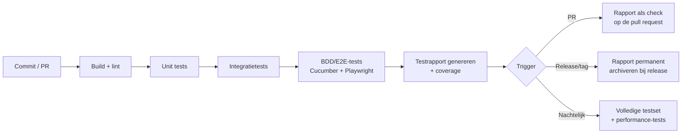

# Testset – DJMusica

Scenario's in Gherkin-stijl, direct bruikbaar met Cucumber/Playwright-BDD e.d. Gegroepeerd per requirement (FR/NFR-referentie tussen haakjes).

## 0. Accounts, inloggen & rollen (FR-33 t/m FR-38, NFR-11)

```gherkin
Feature: Registreren en inloggen

  Scenario: Nieuw account aanmaken
    Given ik heb nog geen account
    When ik registreer met e-mailadres "sanne@example.com" en een wachtwoord
    Then wordt mijn account aangemaakt
    And is mijn wachtwoord gehasht opgeslagen, niet in leesbare vorm

  Scenario: Inloggen met correcte gegevens
    Given ik heb een bestaand account
    When ik inlog met het juiste e-mailadres en wachtwoord
    Then word ik ingelogd

  Scenario: Wachtwoord vergeten
    Given ik heb een bestaand account
    When ik op "wachtwoord vergeten" klik en mijn e-mailadres invul
    Then ontvang ik een tijdelijk geldige resetlink per e-mail
    And kan ik daarmee een nieuw wachtwoord instellen

  Scenario: Oplopende wachttijd na mislukte inlogpogingen
    Given ik heb 4 keer achter elkaar een verkeerd wachtwoord ingevoerd
    When ik voor de 5e keer een verkeerd wachtwoord invoer
    Then moet ik minimaal 1 minuut wachten voor een volgende poging
    When ik daarna weer verkeerd inlog (6e mislukte poging)
    Then is de wachttijd nu 2 minuten
    When ik daarna nog een keer verkeerd inlog (7e mislukte poging)
    Then is de wachttijd nu 4 minuten (steeds verdubbelend)

  Scenario: Registreren direct vanaf een join-link
    Given ik ontvang een join-link voor een sessie en heb nog geen account
    When ik de link open
    Then kan ik direct ter plekke registreren, zonder aparte omweg

Feature: Account verwijderen (FR-44 t/m FR-49, NFR-13)

  Scenario: Verwijderverzoek vereist een ingelogde sessie
    Given ik ben niet ingelogd
    When ik probeer een verwijderverzoek voor een account in te dienen
    Then wordt dit geweigerd

  Scenario: Verwijderverzoek stuurt bevestigingsmail
    Given ik ben ingelogd
    When ik een verzoek indien om mijn account te verwijderen
    Then ontvang ik op mijn geregistreerde e-mailadres een bevestigingsmail met een unieke link
    And heeft het verwijderverzoek op zichzelf nog geen effect zolang ik niet op de link klik

  Scenario: Bevestigingslink is eenmalig en tijdelijk
    Given ik heb een verwijder-bevestigingsmail ontvangen
    When ik 25 uur wacht en dan pas op de link klik
    Then is de link verlopen en gebeurt er niets
    Given ik klik wel op tijd op de link
    When ik daarna nogmaals op dezelfde link klik
    Then heeft de tweede klik geen effect (link is al gebruikt)

  Scenario: Bevestiging start de grace period
    Given ik klik binnen 24 uur op de bevestigingslink
    Then gaat een grace period van 30 dagen in
    And kan mijn account in die periode niet gebruikt worden om mee te spelen of te hosten

  Scenario: Verwijdering ongedaan maken tijdens grace period
    Given mijn account zit in de grace period (dag 10 van 30)
    When ik inlog
    Then krijg ik de optie om de verwijdering te annuleren
    When ik annuleer
    Then is mijn account weer volledig bruikbaar, alle gegevens intact

  Scenario: Herinneringsmail voor einde grace period
    Given mijn account zit in de grace period, nog 7 dagen te gaan
    Then ontvang ik een herinneringsmail dat de verwijdering bijna definitief wordt

  Scenario: Permanente verwijdering na grace period
    Given de grace period van 30 dagen is verstreken zonder annulering
    When de permanente verwijdering wordt uitgevoerd
    Then zijn e-mailadres, naam en wachtwoord-hash van dat account niet meer te achterhalen
    And staat er in plaats daarvan "Verwijderde speler" op plekken waar deze speler eerder zichtbaar was

  Scenario: Andermans scoreborden blijven intact na verwijdering
    Given speler "Mila" heeft meegespeeld in een spel samen met nog actieve spelers "Tom" en "Sanne"
    And Mila's account is permanent verwijderd
    When Tom of Sanne de resultaten van dat spel bekijkt
    Then zijn de ronde-uitslagen en eindstand nog steeds volledig zichtbaar
    And staat Mila's naam vervangen door "Verwijderde speler", zonder de rest van de data te beschadigen

Feature: Eén account, meerdere rollen (FR-36)

  Scenario: Account is zowel speler als spelleider
    Given mijn account heeft de rol "speler"
    When ik de spelleider-rol activeer door een Spotify-app te koppelen (FR-37)
    Then heeft mijn account nu zowel de rol "speler" als "spelleider"

  Scenario: Speler speelt bij verschillende spelleiders met behoud van statistieken
    Given mijn account heeft meegespeeld in een spel van spelleider A
    When ik later meespeel in een spel van een geheel andere spelleider B
    Then telt mijn score in dat spel gewoon mee in mijn totale statistieken (FR-27)
    And is dit hetzelfde account, niet een nieuw account per spelleider

Feature: Eigen Spotify-app koppelen als spelleider (FR-37, FR-38)

  Scenario: Spelleider koppelt eigen Spotify-app
    Given ik ben ingelogd en wil spelleider worden
    When ik de wizard doorloop: link naar Spotify Dashboard openen, redirect-URI kopiëren, eigen Client ID/Secret invoeren
    Then valideert de app direct of de koppeling werkt
    And kan ik daarna sessies hosten met mijn eigen Spotify-app

  Scenario: Meerdere spelleiders hosten gelijktijdig, onafhankelijk van elkaar
    Given spelleider A heeft zijn eigen Spotify-app gekoppeld en host sessie 1
    And spelleider B heeft een andere eigen Spotify-app gekoppeld en host sessie 2, op hetzelfde moment
    Then lopen beide sessies volledig onafhankelijk
    And heeft een probleem met spelleider A's Spotify-koppeling geen effect op sessie 2
```

## 1. Sessie & aanmelden

```gherkin
Feature: Sessie aanmaken en aanmelden (FR-1 t/m FR-4)

  Scenario: Spelleider maakt sessie aan
    Given ik ben ingelogd met een account dat de spelleider-rol heeft (eigen Spotify-app gekoppeld)
    When ik een nieuwe sessie aanmaak
    Then krijg ik een unieke join-code en deelbare link
    And de sessiestatus is "Lobby"

  Scenario: Speler meldt zich aan met zijn account
    Given er is een actieve sessie met code "ABCD"
    And speler "Sanne" is ingelogd met haar account
    When Sanne de join-link opent
    Then verschijnt "Sanne" (uit haar accountprofiel) in de deelnemerslijst bij de spelleider

  Scenario: Niet-ingelogde speler wordt naar registratie/login geleid
    Given er is een actieve sessie met code "ABCD"
    When iemand zonder ingelogd account de join-link opent
    Then wordt eerst om inloggen of registreren gevraagd, vóórdat aanmelden bij de sessie lukt
```

```gherkin
Feature: Eén actieve sessie per account (FR-3a)

  Scenario: Speler kan niet aan twee sessies tegelijk deelnemen
    Given "Tom" speelt al actief mee in sessie "ABCD"
    When Tom probeert ook sessie "WXYZ" te joinen
    Then wordt dit geweigerd met een duidelijke melding dat hij al meespeelt in een ander spel

  Scenario: Spelleider kan niet hosten én elders spelen tegelijk
    Given "Rik" host actief sessie "ABCD" als spelleider
    When Rik probeert als speler mee te doen aan sessie "WXYZ" van een andere spelleider
    Then wordt dit geweigerd

  Scenario: Na afloop van een sessie kan een account weer een nieuwe joinen
    Given "Tom" speelde mee in sessie "ABCD", die inmiddels is afgerond
    When Tom een nieuwe sessie "WXYZ" probeert te joinen
    Then lukt dit gewoon

  Scenario: Meerdere spelleiders hosten volledig los van elkaar, tegelijk
    Given spelleider "Anna" host sessie "AAAA" met haar eigen groep spelers
    And spelleider "Bram" host op hetzelfde moment sessie "BBBB" met een geheel andere groep spelers
    Then lopen beide sessies onafhankelijk naast elkaar
    And heeft niemand uit sessie "AAAA" toegang tot of invloed op sessie "BBBB"
```

## 2. Berichten & feedback (FR-50 t/m FR-53)

```gherkin
Feature: Spelleider stuurt feedback naar de beheerder

  Scenario: Spelleider dient feedback in
    Given ik ben ingelogd als spelleider
    When ik een feedbackbericht typ en verstuur
    Then ontvangt de beheerder dit bericht in zijn/haar berichtenoverzicht

  Scenario: Beheerder reageert op feedback
    Given de beheerder heeft een feedbackbericht van spelleider "Anna" ontvangen
    When de beheerder hierop reageert
    Then ziet Anna deze reactie als antwoord op haar oorspronkelijke bericht

Feature: Beheerder stuurt berichten naar spelleiders

  Scenario: Bericht naar één specifieke spelleider
    Given de beheerder stuurt een bericht naar spelleider "Anna"
    Then ontvangt alleen Anna dit bericht, andere spelleiders niet

  Scenario: Broadcast-bericht naar alle spelleiders
    Given er zijn meerdere spelleiders actief
    When de beheerder een bericht verstuurt als broadcast
    Then ontvangen alle spelleiders dit bericht

  Scenario: Ongelezen-indicatie
    Given een spelleider heeft een nieuw, nog niet bekeken bericht
    Then toont het spelleider-scherm een ongelezen-indicatie
    When de spelleider het bericht opent
    Then verdwijnt de ongelezen-indicatie voor dat bericht
```

## 3. Installeerbaarheid (FR-54)

```gherkin
Feature: App toevoegen aan beginscherm

  Scenario: DJMusica-logo verschijnt als app-icoon
    Given een gebruiker voegt de app toe aan het beginscherm via de browser
    Then verschijnt het DJMusica-logo als icoon op het beginscherm
    And opent de app vanaf dat icoon in een eigen venster, zonder browserbalk

  Scenario: Werkt op zowel iOS als Android
    Given een gebruiker met een iPhone voegt de app toe aan het beginscherm
    Then verschijnt hetzelfde DJMusica-icoon als bij een Android-gebruiker die dit doet
```


## 4. Spelinstellingen

```gherkin
Feature: Beheerder beheert afspeellijsten (FR-5a t/m 5d, FR-12a, FR-12b)

  Scenario: Beheerder voegt afspeellijst toe via Spotify-URL
    Given ik ben ingelogd als beheerder
    When ik een Spotify-playlist-URL invoer
    Then worden de nummers uit die playlist opgehaald via de Spotify Web API
    And verschijnt deze afspeellijst in het keuzemenu voor spelleiders

  Scenario: Beheerder verwijdert een afspeellijst
    Given een afspeellijst is eerder toegevoegd en niet in een actieve sessie in gebruik
    When de beheerder deze afspeellijst verwijdert
    Then is deze niet meer selecteerbaar door spelleiders

  Scenario: Nummer met ontbrekende gegevens wordt standaard geblokkeerd
    Given een nummer heeft geen jaar, of de artiest heeft geen land geregistreerd
    Then is dit nummer niet selecteerbaar voor een ronde
    When de beheerder het ontbrekende gegeven aanvult
    Then wordt het nummer weer selecteerbaar (mits ook niet handmatig uitgesloten)

  Scenario: Beheerder sluit een nummer handmatig uit
    Given een compleet nummer is normaal selecteerbaar
    When de beheerder dit nummer markeert als uitgesloten
    Then wordt het nooit meer gekozen in een ronde
    When de beheerder de uitsluiting ongedaan maakt
    Then is het nummer weer normaal selecteerbaar

  Scenario: Playlist verversen detecteert wijzigingen
    Given een afspeellijst is eerder toegevoegd met 20 nummers
    And in Spotify zijn 2 nummers verwijderd en 3 nieuwe toegevoegd sinds de laatste sync
    When de beheerder op "ververs" klikt
    Then worden de 3 nieuwe nummers toegevoegd (metadata via Spotify, land via ARTIEST-cache of MusicBrainz)
    And worden de 2 verwijderde nummers op "inactief" gezet, niet definitief verwijderd
    And blijven bestaande artiesten met een al bekend land ongewijzigd (geen herhaalde MusicBrainz-call)

  Scenario: Inactieve nummers worden niet meer gekozen
    Given een nummer staat op "inactief" na een sync
    When een nieuwe ronde een nummer kiest uit die afspeellijst
    Then wordt dit inactieve nummer nooit gekozen
```

```gherkin
Feature: Land van herkomst per artiest (FR-28 t/m FR-28b, FR-31)

  Scenario: Land wordt automatisch verrijkt bij hoge matchzekerheid
    Given een nieuwe artiest "Coldplay" komt voor het eerst voor in een afspeellijst
    And de MusicBrainz-match voor deze artiest heeft een zekerheid van 98%
    When de verrijking draait
    Then wordt bij artiest "Coldplay" het land "United Kingdom" automatisch opgeslagen
    And geldt dit land voor alle nummers van Coldplay in alle afspeellijsten

  Scenario: Onzekere MusicBrainz-match wordt niet automatisch overgenomen
    Given een artiestnaam levert een MusicBrainz-match op met een zekerheid van 80%
    When de verrijking draait
    Then blijft het land van die artiest leeg
    And kan de beheerder het land handmatig invullen

  Scenario: Land wordt één keer per artiest bepaald, niet per nummer
    Given artiest "Coldplay" heeft al een vastgelegd land
    When een nieuw nummer van Coldplay wordt toegevoegd aan een afspeellijst (nu of bij een latere verversing)
    Then krijgt dat nummer automatisch hetzelfde land, zonder nieuwe MusicBrainz-aanroep

  Scenario: Handmatige invoer krijgt 100% zekerheid en wordt nooit overschreven
    Given de beheerder vult het land van artiest "Kensington" handmatig in als "Netherlands"
    Then staat de zekerheid voor Kensington op 100%
    When de beheerder later de afspeellijst ververst
    Then blijft het land van Kensington "Netherlands", ook al zou MusicBrainz iets anders opleveren

  Scenario: Land verwijderen triggert nieuwe opzoeking bij volgende verversing
    Given artiest "Kensington" heeft een handmatig ingevuld land "Netherlands" (100%)
    When de beheerder dit land verwijdert
    And daarna de afspeellijst ververst
    Then wordt het land van Kensington opnieuw opgezocht via MusicBrainz

  Scenario: Land kiezen uit vaste lijst, geen vrije tekst
    Given de beheerder wil het land van een artiest invullen
    When het invoerveld voor land geopend wordt
    Then kan alleen een land uit de vaste wereldlijst gekozen worden, geen los getypte tekst

  Scenario: Alfabetisch bladeren door de landenlijst
    Given de beheerder opent de landenkiezer zonder te zoeken
    Then wordt de volledige lijst alfabetisch gesorteerd getoond

  Scenario Outline: Live zoeken filtert op letters die ergens in de naam voorkomen
    Given de beheerder typt "<zoekterm>" in het zoekveld van de landenkiezer
    Then bevat de gefilterde lijst "<verwacht_land>"

    Examples:
      | zoekterm | verwacht_land   |
      | land     | Netherlands     |
      | land     | Finland          |
      | land     | Ireland          |
      | ing      | United Kingdom  |

  Scenario: Zoeken update bij elk ingetikt teken
    Given de beheerder heeft "ni" getypt in het zoekveld
    When de beheerder er een teken aan toevoegt zodat er "nite" staat
    Then wordt de gefilterde lijst direct opnieuw berekend, zonder dat er eerst op "zoeken" geklikt hoeft te worden
```

```gherkin
Feature: Afspeellijst bewerken - nummers gesorteerd op artiest (FR-5c, FR-5d)

  Scenario: Bewerken-knop naast Verversen
    Given ik bekijk het afspeellijst-overzicht als beheerder
    Then zie ik per afspeellijst zowel een knop "Verversen" als een knop "Bewerken"

  Scenario: Onzekere/ontbrekende landen staan bovenaan
    Given een afspeellijst bevat artiesten met bekend land (zekerheid 100%), onzeker land (bv. 80%), en zonder land
    When de beheerder op "Bewerken" klikt
    Then staan de artiesten zonder land of met een zekerheid < 95% bovenaan de lijst, alfabetisch gesorteerd binnen die groep
    And staan de overige artiesten daaronder, ook alfabetisch gesorteerd

  Scenario: Zekerheidspercentage wordt getoond
    Given een artiest heeft een automatisch bepaald land met 97% zekerheid
    When de beheerder het bewerk-scherm bekijkt
    Then ziet hij/zij "97%" naast het land van die artiest
    Given een ander land is handmatig ingevuld
    Then ziet hij/zij "100%" naast dat land
```

```gherkin
Feature: Standaard vraagtype-verdeling instellen per afspeellijst (FR-5b)

  Scenario: Instellingen-knop op afspeellijst-overzicht
    Given ik bekijk het afspeellijst-overzicht als beheerder
    Then zie ik per afspeellijst ook een knop "Instellingen"
    When ik op "Instellingen" klik bij afspeellijst "Jaren 80 Hits"
    Then opent een scherm waar ik de standaard vraagtype-verdeling voor die afspeellijst kan instellen
```

```gherkin
Feature: Instellingen kiezen (FR-5 t/m FR-8)

  Scenario: Spelleider kiest afspeellijst uit beheerd aanbod
    Given de spelleider heeft aanmeldingen gesloten
    And de beheerder heeft minstens 1 afspeellijst toegevoegd
    When de spelleider een afspeellijst uit het aanbod selecteert
    Then wordt deze playlist aan de sessie gekoppeld

  Scenario: Standaard winstpunten
    Given een nieuwe sessie zonder aangepaste instelling
    Then is het aantal punten om te winnen standaard 15

  Scenario: Aangepast puntenaantal
    When de spelleider het winst-aantal instelt op 10
    Then zien alle deelnemers "eerste tot 10 punten wint"

  Scenario: Standaard antwoordtijd
    Given een nieuwe sessie zonder aangepaste instelling
    Then is het maximum aantal seconden per ronde standaard 30

  Scenario: Aangepaste antwoordtijd
    Given de spelleider stelt vóór aanvang van het spel de tijd in op 45 seconden
    When een ronde start
    Then hebben deelnemers 45 seconden om te antwoorden
    And geldt deze tijd voor alle rondes in dit spel (niet per ronde instelbaar)

Feature: Spelleider speelt zelf ook mee (FR-4a t/m FR-4c)

  Scenario: Spelleider kiest om mee te spelen
    Given de spelleider maakt een sessie aan
    When de spelleider "ik speel zelf ook mee" aanzet
    Then verschijnt de spelleider ook als deelnemer in de deelnemerslijst
    And krijgt de spelleider tijdens rondes een antwoordformulier te zien naast de besturing

  Scenario: Spelleider ziet titel/artiest niet, ook als hij meespeelt
    Given de spelleider speelt mee en een ronde is bezig
    Then wordt titel/artiest van het nummer niet getoond op het scherm van de spelleider

  Scenario: Spelleider kan winnen
    Given de spelleider speelt mee en heeft 14 van de 15 punten nodig
    When de spelleider in de volgende ronde het juiste antwoord geeft
    Then eindigt het spel en wordt de spelleider getoond als winnaar

  Scenario: Spelleider speelt niet mee (default)
    Given de spelleider heeft "ik speel zelf ook mee" niet aangezet
    Then verschijnt de spelleider niet in de deelnemerslijst
    And krijgt de spelleider geen antwoordformulier te zien tijdens rondes

  Scenario: Moeilijkheidsgraad instellen
    When de spelleider "makkelijk" kiest
    Then krijgen deelnemers multiple choice vragen deze hele sessie
    When de spelleider "moeilijk" kiest
    Then krijgen deelnemers vrije-tekst vragen deze hele sessie
```

## 5. Ronde-verloop

```gherkin
Feature: Ronde starten en vraagtype (FR-9 t/m FR-14)

  Scenario Outline: Vraagtype wordt getoond volgens ingestelde verdeling
    Given een sessie is gestart
    When een nieuwe ronde begint
    Then is het getoonde vraagtype één van: "jaartal", "jaar plus of min 3", "decennium", "titel", "artiest", "land van herkomst artiest"
    And wordt dit vraagtype getoond vóórdat het nummer start

  Scenario: Beheerder stelt een standaardverdeling in per afspeellijst
    Given de beheerder beheert afspeellijst "Jaren 80 Hits"
    When de beheerder de verdeling instelt op decennium 40%, jaartal 30%, artiest 30%
    Then geldt deze verdeling als standaard voor elke spelleider die deze afspeellijst kiest en zelf nog niets heeft aangepast

  Scenario: Fabrieksstandaard geldt als de beheerder niets heeft ingesteld
    Given een nieuwe afspeellijst zonder eigen standaardverdeling van de beheerder
    Then is de getoonde standaardverdeling: jaartal 10%, jaar±3 20%, decennium 20%, titel 20%, artiest 20%, land van herkomst 10%

  Scenario: Spelleider past verdeling aan voor een specifieke afspeellijst
    Given de spelleider zet, na het kiezen van afspeellijst "Jaren 80 Hits", "land van herkomst" op 0% en verhoogt "artiest" naar 30%
    When een reeks rondes wordt gespeeld
    Then komt vraagtype "land van herkomst artiest" niet voor
    And komt "artiest" naar verhouding vaker voor dan de andere types

  Scenario: Verdeling mag niet boven 100% totaal uitkomen
    Given de spelleider probeert een verdeling in te stellen die optelt tot meer dan 100%
    Then wordt dit geweigerd of automatisch gecorrigeerd, met een duidelijke melding

  Scenario: Terugzetten naar standaard herstelt de afspeellijst-standaard
    Given de beheerder heeft voor "Jaren 80 Hits" een eigen standaardverdeling ingesteld
    And de spelleider heeft deze verdeling tijdens het spel aangepast
    When de spelleider op "zet terug naar standaard" klikt
    Then staat de verdeling weer op de door de beheerder ingestelde standaard voor "Jaren 80 Hits" (niet per se de fabrieksstandaard)

  Scenario: Aangepaste verdeling blijft alleen bewaard bij dezelfde afspeellijst
    Given de spelleider heeft in een vorig spel, met afspeellijst "Jaren 80 Hits", "artiest" op 30% gezet
    When dezelfde spelleider een nieuw spel aanmaakt en opnieuw "Jaren 80 Hits" kiest
    Then staat de verdeling voor "artiest" al standaard op 30%
    When dezelfde spelleider in plaats daarvan afspeellijst "Jaren 90 Dance" kiest
    Then geldt daarvoor de standaardverdeling van "Jaren 90 Dance" (beheerder-ingesteld of fabrieksstandaard), niet de 30% van "Jaren 80 Hits"

  Scenario: Land van herkomst volgt de ingestelde moeilijkheidsgraad
    Given moeilijkheidsgraad "makkelijk" is ingesteld
    And het vraagtype is "land van herkomst artiest"
    When een ronde start
    Then krijgt de deelnemer 4 landen als multiple choice te zien
    Given moeilijkheidsgraad "moeilijk" is ingesteld
    When een ronde met vraagtype "land van herkomst artiest" start
    Then moet de deelnemer het land intypen, met fuzzy matching (Levenshtein ≤ 3)

  Scenario: Nummer zonder compleet land/artiest/titel/jaar wordt niet gekozen
    Given een nummer is niet compleet (FR-12a) of handmatig uitgesloten (FR-12b)
    Then wordt dit nummer nooit gekozen, ongeacht welk vraagtype het systeem trekt

  Scenario: Titel en artiest blijven verborgen
    Given een ronde is gestart en een nummer speelt af
    Then wordt de titel, artiest niet getoond aan deelnemers
    And wordt de titel, artiest ook niet getoond aan de spelleider

  Scenario: Geen herhaling zolang er nog ongebruikte nummers zijn
    Given een afspeellijst van 20 nummers, waarvan er 5 al zijn afgespeeld (playCount 1)
    When een nieuwe ronde een nummer kiest
    Then is het gekozen nummer een van de 15 nog niet gespeelde nummers

  Scenario: Cyclus reset zodra alle nummers gespeeld zijn
    Given een afspeellijst van 20 nummers, allemaal met playCount 1
    When een nieuwe ronde een nummer kiest
    Then wordt gekozen uit alle 20 nummers van de afspeellijst
    And begint de nieuwe cyclus (playCount 2) vanaf het eerstvolgende afgespeelde nummer

  Scenario: Afspelen via Spotify Connect
    Given de spelleider heeft een actief Spotify Connect-apparaat
    When een ronde start
    Then wordt het gekozen nummer daadwerkelijk afgespeeld op dat apparaat
```

## 6. Antwoorden & validatie

```gherkin
Feature: Antwoorden geven en beoordelen (FR-15 t/m FR-19)

  Scenario: Ronde sluit na de ingestelde tijd
    Given een ronde is gestart met een ingestelde tijd van 30 seconden
    And niet alle spelers hebben geantwoord
    When er 30 seconden zijn verstreken
    Then sluit de ronde automatisch voor nieuwe antwoorden

  Scenario: Ronde sluit zodra iedereen heeft geantwoord
    Given 4 van de 4 deelnemers moeten nog antwoorden
    When de laatste deelnemer antwoordt binnen de ingestelde tijd
    Then sluit de ronde direct, zonder te wachten op de resterende tijd

  Scenario: Piepje 10 seconden voor einde van de tijd
    Given een ronde loopt met een ingestelde tijd van 30 seconden
    When er 20 seconden zijn verstreken (10 seconden resterend)
    Then klinkt er een geluidssignaal op alle deelnemersschermen en het spelleider-scherm

  Scenario: Spelleider beëindigt ronde handmatig
    Given een ronde loopt en niet alle deelnemers hebben geantwoord
    When de spelleider op "beëindig ronde nu" klikt
    Then sluit de ronde direct voor nieuwe antwoorden, ook al is de ingestelde tijd nog niet verstreken

  Scenario Outline: Jaar plus of min 3 tolerantie
    Given het juiste jaartal is 1985
    When een deelnemer antwoordt met "<antwoord>"
    Then is het resultaat "<correct>"

    Examples:
      | antwoord | correct |
      | 1985     | juist   |
      | 1982     | juist   |
      | 1988     | juist   |
      | 1981     | onjuist |
      | 1989     | onjuist |

  Scenario Outline: Fuzzy matching bij titel/artiest (Levenshtein ≤ 3)
    Given het juiste antwoord is "Nirvana"
    When een deelnemer antwoordt met "<antwoord>"
    Then is het resultaat "<correct>"

    Examples:
      | antwoord     | correct | toelichting               |
      | Nirvana      | juist   | exacte match               |
      | Nirvanna     | juist   | 1 teken verschil           |
      | Nirvna       | juist   | 1 teken verschil (deletie) |
      | Nirvanaa1    | juist   | 2 tekens verschil          |
      | Nirvanaland  | onjuist | 4 tekens verschil (doorgerekend met de daadwerkelijke implementatie) |
      | Metallica    | onjuist | volledig ander antwoord    |

  Scenario: Multiple choice bij makkelijke modus
    Given moeilijkheidsgraad "makkelijk" is ingesteld
    And het vraagtype is "artiest"
    When een ronde start
    Then krijgt de deelnemer 4 antwoordopties te zien, waarvan er 1 correct is

  Scenario: Correct antwoord levert 1 punt op
    Given een deelnemer geeft het juiste antwoord
    When de ronde wordt afgesloten
    Then krijgt deze deelnemer 1 punt erbij
```

## 7. Resultaten & spelverloop

```gherkin
Feature: Resultaten tonen en spel afronden (FR-20 t/m FR-24)

  Scenario: Resultaten worden getoond na de ronde
    Given een ronde is afgesloten
    Then toont elk scherm het juiste antwoord (titel, artiest, jaar)
    And toont elk scherm of het eigen antwoord goed of fout was
    And toont elk scherm de bijgewerkte stand

  Scenario: Nieuwe ronde start alleen handmatig
    Given resultaten van ronde 3 zijn getoond
    And geen enkele speler heeft de winst-score bereikt
    Then start ronde 4 niet automatisch
    When de spelleider op "volgende ronde" klikt
    Then start ronde 4

  Scenario: Spel eindigt bij bereiken winst-score
    Given het winst-aantal is ingesteld op 15
    And speler "Tom" heeft 14 punten
    When "Tom" in de volgende ronde een punt scoort
    Then eindigt het spel
    And wordt "Tom" getoond als winnaar

  Scenario: Eindscherm is gelijk voor spelers en spelleider
    Given het spel is beëindigd met "Tom" als winnaar
    Then tonen zowel elk spelerscherm als het spelleiderscherm hetzelfde eindscherm
    And bevat dit eindscherm bij iedereen de winnaar en de volledige eindstand/ranking (bv. als podium)
    And is dit niet alleen zichtbaar op het grote scherm van de spelleider

  Scenario: Geen winnaar, spel gaat door
    Given het winst-aantal is 15
    And geen enkele speler heeft 15 punten na de ronde
    Then gaat het spel door naar de volgende ronde

  Scenario: Gelijktijdig winst-score bereikt — snelste reactietijd wint
    Given het winst-aantal is 15
    And zowel "Tom" (14 punten) als "Anna" (14 punten) antwoorden goed in dezelfde ronde
    And "Anna" antwoordde in 4.2 seconden en "Tom" in 6.8 seconden
    When de ronde wordt afgesloten
    Then hebben zowel "Tom" als "Anna" 15 punten
    And wordt "Anna" getoond als winnaar (snelste correcte reactietijd)
```

## 8. Persistente opslag & statistieken (FR-25 t/m FR-27, NFR-7)

```gherkin
Feature: Track-afspeelhistorie en speler-statistieken blijven bewaard

  Scenario: Play-count wordt bijgewerkt na afspelen
    Given nummer "X" heeft playCount 2
    When nummer "X" wordt afgespeeld in een ronde
    Then heeft nummer "X" playCount 3
    And is "laatstGespeeld" bijgewerkt naar het huidige tijdstip

  Scenario: Statistieken blijven beschikbaar na afloop van een sessie
    Given een sessie is afgerond met 5 rondes en een winnaar
    When de sessie is afgesloten
    Then zijn de antwoorden en resultaten van die sessie nog opvraagbaar uit de database

  Scenario: Statistieken tellen op over meerdere spellen heen
    Given speler "Sanne" heeft in 3 verschillende spellen in totaal 40 vragen goed beantwoord van de 60
    When de statistieken voor "Sanne" worden opgevraagd
    Then wordt een score van 40/60 (66,7%) getoond, opgeteld over alle spellen
```

```gherkin
Feature: Spelstatistieken (FR-39)

  Scenario: Spelstatistieken na afloop van een spel
    Given een spel is afgerond met 8 rondes
    When de spelleider van dat spel de statistieken bekijkt
    Then ziet hij/zij aantal rondes, gemiddelde speelduur, % goed per vraagtype, gemiddelde reactietijd en de gebruikte afspeellijst

  Scenario: Spelstatistieken alleen zichtbaar voor de betrokken spelleider en beheerder
    Given spelleider "Tom" heeft een spel gehost, spelleider "Rik" niet
    When "Rik" probeert de spelstatistieken van Tom's spel te bekijken
    Then krijgt Rik geen toegang
    When de beheerder dezelfde statistieken opvraagt
    Then krijgt de beheerder wel toegang
```

```gherkin
Feature: Spelerstatistieken (FR-40, FR-43)

  Scenario: Spelerstatistieken over alle spellen en spelleiders heen
    Given speler "Sanne" heeft meegespeeld bij spelleider A en later bij spelleider B
    When Sanne haar eigen statistieken bekijkt
    Then ziet ze totaal gespeelde spellen/rondes, win-percentage, % goed per vraagtype, gemiddelde/snelste reactietijd, langste win-streak en vaakst gespeelde afspeellijst
    And zijn deze cijfers opgeteld over beide spelleiders, niet per spelleider apart gescheiden

  Scenario: Vergelijking met het gemiddelde van alle spelers
    Given het gemiddelde percentage goed over alle spelers is 62%
    And speler "Tom" heeft zelf 74% goed
    When Tom zijn statistieken bekijkt
    Then ziet hij een vergelijking zoals "boven het gemiddelde" naast zijn eigen cijfer

  Scenario: Speler ziet alleen eigen statistieken, niet die van anderen
    Given speler "Mila" is ingelogd
    When Mila statistieken van speler "Rik" probeert te bekijken
    Then krijgt Mila geen toegang tot Rik's persoonlijke statistieken
```

```gherkin
Feature: Spelleiderstatistieken (FR-41)

  Scenario: Spelleider bekijkt eigen hostgeschiedenis
    Given spelleider "Tom" heeft 5 spellen gehost
    When Tom zijn spelleiderstatistieken bekijkt
    Then ziet hij aantal gehoste spellen, gemiddeld aantal spelers per sessie, populairste afspeellijst en gemiddelde spelduur
```

```gherkin
Feature: Marketing-/groeistatistieken (FR-42)

  Scenario: Alleen de beheerder ziet marketingstatistieken
    Given een spelleider probeert de marketingstatistieken te bekijken
    Then krijgt de spelleider geen toegang
    When de beheerder dezelfde statistieken opvraagt
    Then ziet de beheerder actieve accounts (nieuw/terugkerend), sessies per periode, retentie, populairste afspeellijsten en aantal actieve spelleiders met gekoppelde Spotify-app

  Scenario: Retentie telt hergebruik over verschillende spelleiders heen
    Given speler "Sanne" speelde vorige week mee bij spelleider A
    And speelt deze week mee bij een geheel andere spelleider B
    When de retentiestatistiek wordt berekend
    Then telt dit mee als een terugkerende speler, ongeacht dat het een andere spelleider betreft
```

## 9. Non-functionele tests

```gherkin
Feature: Spelleiderscherm leesbaar op telefoonformaat (herzien NFR-2)

  Scenario: Spelleiderscherm op iPhone-breedte
    Given een spelleider opent het spelleiderscherm op een iPhone (smalle viewport)
    Then blijven alle besturingsknoppen, live-antwoordenlijst en timer leesbaar en bruikbaar zonder horizontaal scrollen

  Scenario: Spelleiderscherm op iPad/groot scherm
    Given een spelleider opent het spelleiderscherm op een iPad of laptop (brede viewport)
    Then wordt de bredere ruimte benut (bv. layout naast elkaar in plaats van onder elkaar), zonder functionaliteit te verliezen

  Scenario: Geen layout-verspringing tijdens gebruik
    Given een scherm laadt asynchrone content (bv. avatars, live-antwoordenlijst)
    When deze content binnenkomt
    Then blijft de rest van de pagina op zijn plek, zonder dat andere elementen verschuiven

  Scenario: Correcte weergave bij notch/dynamic island
    Given het scherm wordt geopend op een iPhone met notch of dynamic island
    Then blijft alle content binnen de veilige zone (`safe-area`), niet verborgen achter de notch of de statusbalk
```

```gherkin
Feature: Beveiliging in lagen (NFR-13)

  Scenario: Onversleuteld verkeer wordt geweigerd
    Given een client probeert de app via http:// (niet https://) te benaderen
    Then wordt het verkeer omgeleid naar https:// of geweigerd

  Scenario: Database niet direct vanaf internet bereikbaar
    Given de Postgres- en Redis-poorten
    Then zijn deze niet vanaf het publieke internet te benaderen, alleen binnen het interne netwerk

  Scenario: SQL-injectie wordt geneutraliseerd
    Given een gebruiker voert `'; DROP TABLE users; --` in bij een tekstveld (bv. weergavenaam)
    When dit verwerkt wordt
    Then gebeurt er geen ongewenste database-actie, en wordt de invoer als gewone tekst behandeld

  Scenario: Rate-limiting op de API in het algemeen
    Given een client stuurt binnen 1 minuut een ongebruikelijk hoog aantal requests naar een endpoint
    Then worden verdere requests tijdelijk geweigerd (429-foutcode) totdat de limiet weer opent

  Scenario: Automatische kwetsbaarheden-scan in CI
    Given een dependency-update introduceert een bekende kwetsbaarheid
    When de CI-pipeline draait
    Then verschijnt hiervan een waarschuwing/melding, zichtbaar vóór een merge naar main

  Scenario: Back-up is gescheiden van de live-server
    Given de live-server valt volledig uit of wordt gecompromitteerd
    Then is er een recente, versleutelde back-up beschikbaar op een andere locatie om van te herstellen
```

```gherkin
Feature: Realtime sync en robuustheid (NFR-1, NFR-5)

  Scenario: Synchrone timer bij alle deelnemers
    Given een ronde start
    Then verschilt de getoonde resterende tijd tussen clients niet meer dan 1 seconde

  Scenario: Deelnemer herstelt verbinding zonder puntenverlies
    Given een deelnemer heeft 5 punten en verliest tijdelijk verbinding
    When de deelnemer binnen 10 seconden opnieuw verbindt
    Then behoudt de deelnemer zijn 5 punten
    And kan de deelnemer meedoen aan de lopende of volgende ronde

  Scenario: Meerdere sessies tegelijk (voorbereid op schaal, NFR-3)
    Given sessie "A" en sessie "B" lopen tegelijk op dezelfde server
    When in sessie "A" een ronde wordt afgesloten
    Then heeft dit geen effect op de state van sessie "B"

  Scenario: Niet-geautoriseerd Spotify-account krijgt duidelijke foutmelding (NFR-10)
    Given een spelleider probeert in te loggen met een Spotify-account dat niet op de allowlist staat
    When de OAuth-koppeling wordt geprobeerd
    Then krijgt de spelleider een duidelijke melding dat het account eerst door de beheerder toegevoegd moet worden
    And faalt de koppeling met een 403-achtige foutafhandeling, niet een onduidelijke crash
```

## 10. Unit-testniveau (Answer Matcher — geïsoleerd, geen UI nodig)

Concrete testcases om als unit tests te implementeren voor de fuzzy-match/jaar-tolerantie logica:

| Input correct | Input gebruiker | Vraagtype | Verwacht resultaat |
|---|---|---|---|
| "The Beatles" | "the beatles" | artiest | juist (hoofdlettergevoeligheid negeren) |
| "The Beatles" | "The Beattles" | artiest | juist (1 teken verschil, ≤3) |
| "The Beatles" | "Beatles" | artiest | *open vraag: gedeeltelijke match (woorden weglaten) apart afwegen van Levenshtein, want scheelt >3 tekens puur op lengte* |
| 1999 | 1999 | jaartal | juist |
| 1999 | 2000 | jaartal | onjuist |
| jaren 90 | "90's" | decennium | juist |
| jaren 90 | "jaren 80" | decennium | onjuist |
| 2001 | 2004 (±3) | jaar plus/min 3 | juist |
| 2001 | 2005 (±3) | jaar plus/min 3 | onjuist |

## 11. Testuitvoering & bewaren van testbewijs

### 9.1 Wanneer draaien de tests
- **Bij elke commit/pull request**: unit- en integratietests altijd; de belangrijkste BDD/E2E-scenario's (aanmelden, ronde-verloop, scoring) als snelle check.
- **Nachtelijk/geplande volledige run**: alle Gherkin-scenario's uit dit document, inclusief de zwaardere multi-client E2E-scenario's (WebSocket-sync, reconnect, meerdere gelijktijdige sessies, sync met Spotify/MusicBrainz).
- **Bij elke release/tag**: de volledige testset moet groen zijn; het testrapport van die run wordt bij de release gearchiveerd (zie 9.4).

### 9.2 Tooling per testniveau

| Niveau | Voorstel tool | Dekt |
|---|---|---|
| Unit | Jest/Vitest | Answer Matcher (fuzzy-matching, jaar-tolerantie), Track Picker-cyclus-logica |
| Integratie | Jest + test-doubles voor Spotify/MusicBrainz | Game Engine state machine, database-opslag, Playlist Sync Service |
| BDD/E2E | Cucumber + Playwright (aparte browsercontext per client) | De scenario's uit secties 1 t/m 7 van dit document, met spelleider- én meerdere deelnemer-clients tegelijk |
| Performance/NFR | k6 of Artillery (WebSocket-load) | NFR-1 (sync <1s), NFR-3 (meerdere sessies tegelijk) |

### 9.3 CI/CD-pipeline (voorstel)



### 9.4 Testbewijs bewaren

- Elke pipeline-run genereert: een JUnit/Cucumber-testrapport (pass/fail per scenario), een coverage-rapport, en bij falende E2E-tests een screenshot/video plus browser-consolelog van het moment van falen.
- Deze artefacten worden bewaard als CI-build-artefacten (bv. GitHub Actions Artifacts), met een bewaartermijn van bv. 90 dagen voor gewone commits — voldoende om een probleem terug te kunnen traceren zonder onbeperkt op te slaan.
- Bij elke release/tag wordt het testrapport van die run **permanent** gearchiveerd (bv. als bijlage bij de GitHub Release, of in een aparte, langdurige opslaglocatie), zodat je achteraf altijd kunt aantonen welke tests slaagden bij welke versie — handig bij een latere bug-melding ("deed dit het al bij versie X?").
- Scenario's in dit document worden getagd met hun FR/NFR-nummer (bv. `@FR-17`, `@NFR-1`), zodat het testrapport traceerbaarheid geeft: welke requirement door welke test gedekt is, en welke nog geen dekking heeft.
